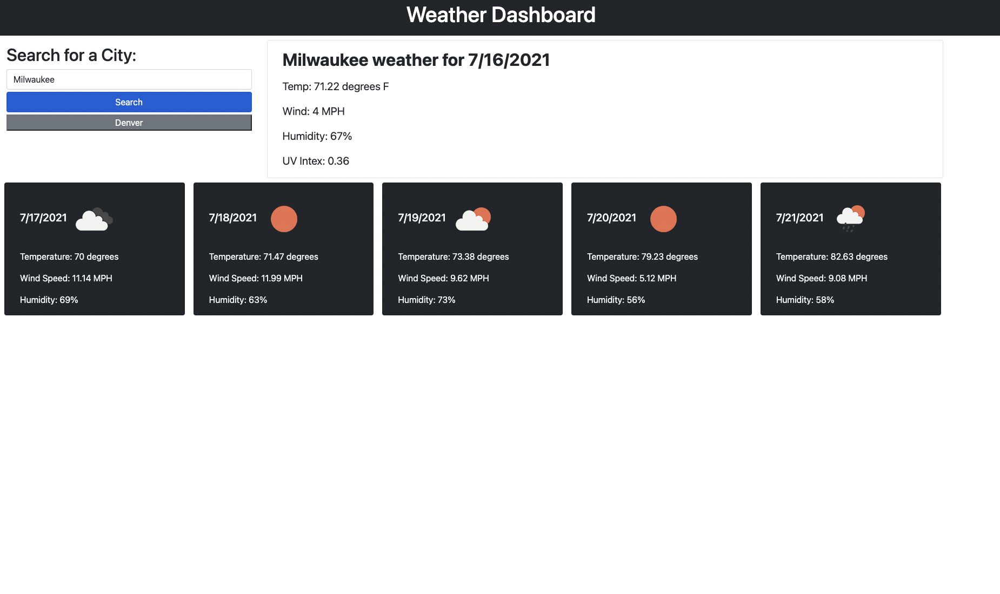

# Weather Dashboard

## Objective
Search for any city in the world and see not only their current weather but also their 5 day forecast! The search bar retrieves the user's query by fetching data from a weather API and then displaying the data by way of bootstrap styling. Previously searched cities are appended to the page in button form for quick access.

## Technologies Used
* HTML
* Javascript
* Bootstrap
* API

## Links
* Deployed Site: https://evapopp.github.io/weather-dashboard/
* Repo: https://github.com/evapopp/weather-dashboard

## Page Preview

